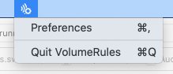
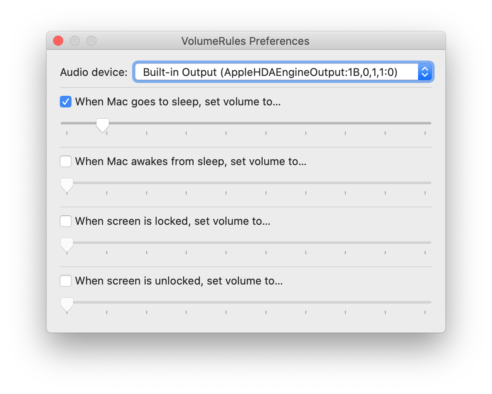

# VolumeRules

Does it annoy you if you open your Mac and have forgotten to mute the volume after you last used it?

This app allows you to set specific rules which will automatically adjust your Mac volume based on certain events.

It's a menubar app:

Screenshot of Preferences:

## Download

~~[**Download v0.1**](https://github.com/codeclown/VolumeRules/releases/download/v0.1/VolumeRules.app.zip) (344 KB)~~

I can't seem to export an .app that could be downloaded and opened by anyone. In the meantime, feel free to open this project in Xcode and build yourself.

Tested only on Catalina.

## Troubleshooting

First check the logs:

1. Open Console.app
2. Set a filter "VolumeRules" (case-insensitive)
3. Leave Console.app open
4. Reproduce the issue you were seeing

The output you see in Console.app should provide some more information as to what happened or didn't happen.

If you've encountered a bug, please file an issue.

## Contributing

Contributions very welcome.

## License

The source code and related assets are licensed under [GNU GPLv3](https://choosealicense.com/licenses/gpl-3.0/).
